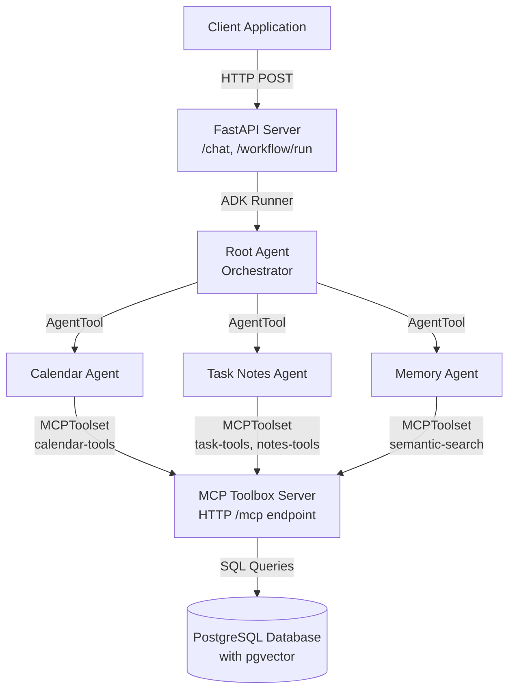

# Design Document: Multi-Agent Productivity System

## Overview

The Multi-Agent Productivity System is an AI-powered personal assistant that uses a hierarchical multi-agent architecture to manage tasks, calendar events, and notes through natural language interaction. The system consists of four key layers:

1. **API Layer**: FastAPI REST service exposing /chat and /workflow/run endpoints
2. **Agent Layer**: Hierarchical multi-agent system with a root orchestrator and three specialized sub-agents
3. **Tool Layer**: Model Context Protocol (MCP) toolbox providing 12 database-backed tools organized into 4 toolsets
4. **Data Layer**: PostgreSQL database with vector embeddings for semantic search

The architecture follows the principle of least privilege, where each specialized agent has access only to the tools required for its domain. The root agent coordinates sub-agents but has no direct tool access, ensuring clean separation of concerns.

## Architecture

### High-Level System Architecture



### Agent Hierarchy

The system uses a three-tier agent hierarchy:

**Root Agent (Orchestrator)**
- Model: gemini-2.5-flash
- Role: Receives user requests, identifies required domains, delegates to sub-agents
- Tools: AgentTool wrappers for three sub-agents (no direct MCP tools)
- Responsibilities:
  - Parse user intent and identify single-domain vs multi-domain requests
  - Execute multi-step workflows by calling sub-agents in sequence
  - Consolidate responses from multiple sub-agents
  - Maintain conversation context via session management

**Calendar Agent (Specialist)**
- Model: gemini-2.5-flash
- Role: Manages calendar events and availability
- Tools: calendar-tools toolset (3 tools)
  - create-event
  - list-events
  - check-availability
- Responsibilities:
  - Convert natural language time expressions to ISO 8601 format
  - Create calendar events with validation
  - Check time slot conflicts using range intersection
  - List upcoming events within specified time windows

**Task Notes Agent (Specialist)**
- Model: gemini-2.5-flash
- Role: Manages tasks and notes
- Tools: task-tools and notes-tools toolsets (6 tools)
  - create-task, list-tasks, update-task-status, get-task
  - create-note, list-notes
- Responsibilities:
  - Create and manage tasks with priorities and due dates
  - Update task status through workflow stages
  - Create notes with tags for organization
  - List and filter tasks by status and priority

**Memory Agent (Specialist)**
- Model: gemini-2.5-flash
- Role: Performs semantic search across historical data
- Tools: semantic-search toolset (2 tools)
  - semantic-search-notes
  - semantic-search-tasks
- Responsibilities:
  - Execute natural language queries against vector embeddings
  - Rank results by relevance score (cosine similarity)
  - Present results with explanations of relevance

### MCP Toolbox Architecture

The MCP Toolbox is a standalone HTTP server that exposes database operations as tools via the Model Context Protocol. It provides:

**Tool Organization**
- 12 tools organized into 4 toolsets
- Declarative YAML configuration (toolbox-docker.yaml)
- Tool filtering by toolset name for access control
- Postgres-SQL tool kind for database operations

**Toolsets**
1. **calendar-tools**: create-event, list-events, check-availability
2. **task-tools**: create-task, list-tasks, update-task-status, get-task
3. **notes-tools**: create-note, list-notes
4. **semantic-search**: semantic-search-notes, semantic-search-tasks

**Connection Architecture**
- Each agent creates an MCPToolset with StreamableHTTPConnectionParams
- Connection URL: http://localhost:5000/mcp (configurable via TOOLBOX_URL)
- Tool filtering applied at connection time using tool_filter parameter
- Tools execute parameterized SQL statements against PostgreSQL

## Components and Interfaces

### API Server Component (api/main.py)

**Technology**: FastAPI with CORS middleware

**Endpoints**:

```python
GET /health
Response: {"status": "ok", "service": "productivity-copilot", "version": "1.0.0"}

POST /chat
Request: {
  "message": str,
  "session_id": str | null,
  "user_id": str (default: demo user UUID)
}
Response: {
  "response": str,
  "session_id": str,
  "user_id": str
}

POST /workflow/run
Request: {
  "instruction": str,
  "user_id": str (default: demo user UUID)
}
Response: {
  "session_id": str,
  "workflow_steps": [str],  # List of agent names involved
  "response": str
}
```

**Session Management**:
- Uses InMemorySessionService from Google ADK
- Creates new session if session_id not provided
- Maintains conversation context across multiple turns
- Session IDs are UUIDs generated by uuid.uuid4()

**Runner Integration**:
- Uses Google ADK Runner with root_agent
- Streams events asynchronously via runner.run_async()
- Extracts final response from is_final_response() events
- Tracks workflow steps by capturing event.author

### Agent Components

**Root Agent (agents/root_agent.py)**

Interface:
```python
LlmAgent(
    model="gemini-2.5-flash",
    name="root_agent",
    description="Root orchestrator agent for the Productivity Copilot system.",
    instruction="""...""",
    tools=[
        AgentTool(agent=calendar_agent),
        AgentTool(agent=task_notes_agent),
        AgentTool(agent=memory_agent),
    ]
)
```

Decision Logic:
- Single-domain requests → delegate to one sub-agent
- Multi-step workflows → call multiple agents in sequence
- Search/recall requests → start with memory_agent
- Consolidate all sub-agent responses into structured output

**Calendar Agent (agents/calendar_agent.py)**

Interface:
```python
LlmAgent(
    model="gemini-2.5-flash",
    name="calendar_agent",
    description="Specialist agent for calendar management.",
    instruction="""...""",
    tools=[get_calendar_toolset()]
)
```

Key Behaviors:
- Converts natural language times to ISO 8601 format
- Assumes 1-hour duration if end time not specified
- Always passes DEMO_USER_ID to tool calls
- Confirms event creation with title and time

**Task Notes Agent (agents/task_notes_agent.py)**

Interface:
```python
LlmAgent(
    model="gemini-2.5-flash",
    name="task_notes_agent",
    description="Specialist agent for task and note management.",
    instruction="""...""",
    tools=[get_task_notes_toolset()]
)
```

Key Behaviors:
- Defaults to 'medium' priority if not specified
- Converts natural language due dates to ISO 8601
- Groups task lists by priority
- Parses comma-separated tags for notes

**Memory Agent (agents/memory_agent.py)**

Interface:
```python
LlmAgent(
    model="gemini-2.5-flash",
    name="memory_agent",
    description="Specialist agent for semantic memory retrieval.",
    instruction="""...""",
    tools=[get_memory_toolset()]
)
```

Key Behaviors:
- Searches notes first, then tasks if needed
- Defaults to 5 results unless specified
- Presents results with relevance scores
- Never invents results when none found

### MCP Toolset Component (tools/mcp_toolsets.py)

**Factory Functions**:

```python
def get_toolset(toolset_name: str) -> MCPToolset:
    """Returns MCPToolset filtered to specific toolset"""
    return MCPToolset(
        connection_params=StreamableHTTPConnectionParams(
            url=f"{TOOLBOX_URL}/mcp",
            headers={"Content-Type": "application/json"},
        ),
        tool_filter=[toolset_name],
    )

def get_calendar_toolset() -> MCPToolset:
    return get_toolset("calendar-tools")

def get_task_notes_toolset() -> MCPToolset:
    return MCPToolset(
        connection_params=StreamableHTTPConnectionParams(
            url=f"{TOOLBOX_URL}/mcp",
        ),
        tool_filter=["task-tools", "notes-tools"],
    )

def get_memory_toolset() -> MCPToolset:
    return get_toolset("semantic-search")
```

**Configuration**:
- TOOLBOX_URL environment variable (default: http://localhost:5000)
- Tool filtering enforces principle of least privilege
- HTTP connection with JSON content type

## Data Models

### Database Schema

**users table**:
```sql
id UUID PRIMARY KEY DEFAULT uuid_generate_v4()
email VARCHAR(255) UNIQUE NOT NULL
name VARCHAR(255)
created_at TIMESTAMPTZ DEFAULT NOW()
updated_at TIMESTAMPTZ DEFAULT NOW()
```

**tasks table**:
```sql
id UUID PRIMARY KEY DEFAULT uuid_generate_v4()
user_id UUID NOT NULL
title VARCHAR(500) NOT NULL
description TEXT DEFAULT ''
status VARCHAR(50) DEFAULT 'pending' 
  CHECK (status IN ('pending', 'in_progress', 'done', 'cancelled'))
priority VARCHAR(20) DEFAULT 'medium' 
  CHECK (priority IN ('low', 'medium', 'high'))
due_date TIMESTAMPTZ
embedding vector(768)  -- For semantic search
created_at TIMESTAMPTZ DEFAULT NOW()
updated_at TIMESTAMPTZ DEFAULT NOW()

INDEXES:
- idx_tasks_user_id ON user_id
- idx_tasks_status ON status
- idx_tasks_due_date ON due_date
- idx_tasks_embedding ON embedding USING ivfflat (vector_cosine_ops)
```

**calendar_events table**:
```sql
id UUID PRIMARY KEY DEFAULT uuid_generate_v4()
user_id UUID NOT NULL
title VARCHAR(500) NOT NULL
description TEXT DEFAULT ''
start_time TIMESTAMPTZ NOT NULL
end_time TIMESTAMPTZ NOT NULL
location VARCHAR(500) DEFAULT ''
created_at TIMESTAMPTZ DEFAULT NOW()
updated_at TIMESTAMPTZ DEFAULT NOW()

CONSTRAINT valid_time_range CHECK (end_time > start_time)

INDEXES:
- idx_calendar_user_id ON user_id
- idx_calendar_start_time ON start_time
- idx_calendar_time_range ON tstzrange(start_time, end_time) USING gist
```

**notes table**:
```sql
id UUID PRIMARY KEY DEFAULT uuid_generate_v4()
user_id UUID NOT NULL
title VARCHAR(500) NOT NULL
content TEXT NOT NULL
tags TEXT[] DEFAULT '{}'
embedding vector(768)  -- For semantic search
created_at TIMESTAMPTZ DEFAULT NOW()
updated_at TIMESTAMPTZ DEFAULT NOW()

INDEXES:
- idx_notes_user_id ON user_id
- idx_notes_tags ON tags USING gin
- idx_notes_created_at ON created_at DESC
- idx_notes_embedding ON embedding USING ivfflat (vector_cosine_ops)
```

### API Request/Response Models

**ChatRequest**:
```python
message: str
session_id: str | None
user_id: str (default: "00000000-0000-0000-0000-000000000001")
```

**ChatResponse**:
```python
response: str
session_id: str
user_id: str
```

**WorkflowRequest**:
```python
instruction: str
user_id: str (default: "00000000-0000-0000-0000-000000000001")
```

**WorkflowResponse**:
```python
session_id: str
workflow_steps: List[str]
response: str
```

### MCP Tool Parameter Models

**create-task parameters**:
```yaml
user_id: string (UUID)
title: string
description: string
priority: string (low|medium|high)
due_date: string (ISO 8601 or empty)
```

**create-event parameters**:
```yaml
user_id: string (UUID)
title: string
description: string
start_time: string (ISO 8601)
end_time: string (ISO 8601)
location: string
```

**semantic-search-notes parameters**:
```yaml
user_id: string (UUID)
query: string (natural language)
limit: integer (default 5)
```

### Vector Embedding Model

**Dimensions**: 768-dimensional vectors
**Model**: text-embedding-005 (Google Cloud)
**Storage**: PostgreSQL vector type (pgvector extension)
**Similarity Metric**: Cosine distance (1 - cosine_similarity)
**Index Type**: IVFFlat with vector_cosine_ops

**Embedding Generation**:
- Tasks: Concatenation of title + description
- Notes: Concatenation of title + content
- Generated at insertion time (future: via database triggers)

## API Specifications

### REST API Endpoints

**Health Check**
```
GET /health
Response: 200 OK
{
  "status": "ok",
  "service": "productivity-copilot",
  "version": "1.0.0"
}
```

**Chat Endpoint**
```
POST /chat
Content-Type: application/json

Request Body:
{
  "message": "Schedule a meeting tomorrow at 3 PM",
  "session_id": "optional-uuid",
  "user_id": "00000000-0000-0000-0000-000000000001"
}

Response: 200 OK
{
  "response": "I've scheduled your meeting for tomorrow at 3:00 PM...",
  "session_id": "generated-or-provided-uuid",
  "user_id": "00000000-0000-0000-0000-000000000001"
}
```

**Workflow Endpoint**
```
POST /workflow/run
Content-Type: application/json

Request Body:
{
  "instruction": "I have a meeting at 3 PM, create a task to prepare slides, and note the action items",
  "user_id": "00000000-0000-0000-0000-000000000001"
}

Response: 200 OK
{
  "session_id": "generated-uuid",
  "workflow_steps": ["root_agent", "calendar_agent", "task_notes_agent"],
  "response": "## Calendar\nCreated event...\n\n## Tasks\nCreated task...\n\n## Notes\nSaved note..."
}
```

### MCP Tool API

**Tool Invocation Protocol**:
```
POST {TOOLBOX_URL}/mcp
Content-Type: application/json

Request:
{
  "tool": "create-task",
  "parameters": {
    "user_id": "00000000-0000-0000-0000-000000000001",
    "title": "Review budget",
    "description": "Q1 budget analysis",
    "priority": "high",
    "due_date": "2024-04-15T17:00:00Z"
  }
}

Response:
{
  "result": [
    {
      "id": "generated-uuid",
      "title": "Review budget",
      "status": "pending",
      "priority": "high",
      "due_date": "2024-04-15T17:00:00Z",
      "created_at": "2024-04-13T10:30:00Z"
    }
  ]
}
```

**Tool Discovery**:
- MCPToolset automatically discovers available tools from toolbox server
- Tool filtering applied via tool_filter parameter
- Tools exposed as callable methods on agent's tools list

### Database Query Patterns

**Time Range Overlap (Conflict Detection)**:
```sql
SELECT COUNT(*) AS conflict_count, ARRAY_AGG(title) AS conflicting_events
FROM calendar_events
WHERE user_id = $1::uuid
  AND tstzrange(start_time, end_time) && tstzrange($2::timestamptz, $3::timestamptz);
```

**Semantic Search (Simplified for Development)**:
```sql
SELECT id, title, content, tags, created_at, 0.5 AS relevance
FROM notes
WHERE user_id = $1::uuid
  AND (title ILIKE '%' || $2 || '%' OR content ILIKE '%' || $2 || '%')
ORDER BY created_at DESC
LIMIT $3;
```

**Task Ordering by Priority**:
```sql
SELECT id, title, description, status, priority, due_date, created_at
FROM tasks
WHERE user_id = $1::uuid AND ($2 = 'all' OR status = $2)
ORDER BY
  CASE priority WHEN 'high' THEN 1 WHEN 'medium' THEN 2 ELSE 3 END,
  due_date NULLS LAST
LIMIT 20;
```


## Correctness Properties

*A property is a characteristic or behavior that should hold true across all valid executions of a system—essentially, a formal statement about what the system should do. Properties serve as the bridge between human-readable specifications and machine-verifiable correctness guarantees.*

### Property Reflection

After analyzing all acceptance criteria, I identified the following redundancies:
- Properties 7.4 and 8.3 both test session reuse → consolidated into Property 11
- Properties 2.6, 11.3, and 14.4 all test time range validation → consolidated into Property 5
- Properties 11.1, 11.2, and 14.3 all test constraint validation → consolidated into Property 27
- Properties 5.3 and 20.2 both test result ordering → consolidated into Property 14
- Properties 5.4 and 20.5 both test result limiting → consolidated into Property 15
- Properties 1.5, 17.5 both test user_id preservation → consolidated into Property 1
- Properties 11.7 and 17.2 both test data isolation → consolidated into Property 28
- Properties 2.3 and 19.1 both test conflict detection → consolidated into Property 6
- Properties 3.5 and 18.6 both test task ordering → consolidated into Property 8
- Properties 5.5 and 18.5 both test empty results → marked as edge case

The remaining properties provide unique validation value and comprehensive coverage of the system's functional requirements.

### Property 1: User ID Preservation Across Agent Delegation

*For any* user request delegated from the Root_Agent to a sub-agent, the user_id SHALL be preserved and passed to all tool calls made by the sub-agent.

**Validates: Requirements 1.5, 17.5**

### Property 2: Single-Domain Request Routing

*For any* user request that involves only one domain (calendar, tasks/notes, or memory), the Root_Agent SHALL delegate to exactly one sub-agent.

**Validates: Requirements 1.2**

### Property 3: Multi-Domain Workflow Execution

*For any* user request that involves multiple domains, the Root_Agent SHALL call multiple sub-agents and consolidate their responses into a single structured response.

**Validates: Requirements 1.3, 1.4, 9.3**

### Property 4: Event Creation Round Trip

*For any* valid event parameters (title, start_time, end_time, user_id), creating an event then retrieving it by ID SHALL return an event with equivalent parameters.

**Validates: Requirements 2.1**

### Property 5: Time Range Constraint Enforcement

*For any* calendar event where end_time is less than or equal to start_time, the Database SHALL reject the creation with a constraint violation error.

**Validates: Requirements 2.6, 11.3, 14.4**

### Property 6: Availability Conflict Detection

*For any* time slot and user_id, checking availability SHALL correctly identify all events that overlap with the time slot using range intersection, returning the count and titles of conflicting events.

**Validates: Requirements 2.3, 19.1, 19.2, 19.3**

### Property 7: Event List Time Filtering

*For any* user_id and days_ahead value, listing events SHALL return only events where start_time falls between NOW() and NOW() + days_ahead days.

**Validates: Requirements 2.2**

### Property 8: Task List Priority Ordering

*For any* user_id and status filter, listing tasks SHALL return tasks ordered first by priority (high, medium, low) then by due_date with nulls last.

**Validates: Requirements 3.5, 18.6**

### Property 9: Task Creation Round Trip

*For any* valid task parameters (user_id, title, description, priority, due_date), creating a task then retrieving it by ID SHALL return a task with equivalent parameters.

**Validates: Requirements 3.1, 3.7**

### Property 10: Task Status Update Timestamp

*For any* task and new status value, updating the task status SHALL change both the status field and set updated_at to a timestamp greater than the previous updated_at value.

**Validates: Requirements 3.6**

### Property 11: Session Context Preservation

*For any* existing session_id, making multiple chat requests with that session_id SHALL maintain conversation context across all requests within the session.

**Validates: Requirements 7.4, 7.6, 8.3**

### Property 12: Session ID Generation for New Conversations

*For any* chat request that omits session_id, the API_Server SHALL generate a new session_id that is a valid UUID format.

**Validates: Requirements 7.5, 8.5**

### Property 13: Unique Session Creation

*For any* two new conversations initiated without session_id, the generated session_ids SHALL be distinct.

**Validates: Requirements 8.1**

### Property 14: Search Results Relevance Ordering

*For any* semantic search query (notes or tasks), the results SHALL be ordered by relevance score in descending order.

**Validates: Requirements 5.3, 20.2**

### Property 15: Search Results Limit Enforcement

*For any* semantic search with a specified limit value, the number of returned results SHALL NOT exceed that limit.

**Validates: Requirements 5.4, 20.5**

### Property 16: Note Creation Round Trip

*For any* valid note parameters (user_id, title, content, tags), creating a note then retrieving it by ID SHALL return a note with equivalent parameters.

**Validates: Requirements 4.1**

### Property 17: Tag Parsing Consistency

*For any* comma-separated tag string, creating a note with those tags then retrieving the note SHALL return a tags array where joining with commas produces an equivalent string (ignoring whitespace).

**Validates: Requirements 4.2**

### Property 18: Note List Recency Ordering

*For any* user_id, listing notes SHALL return at most 10 notes ordered by created_at in descending order (most recent first).

**Validates: Requirements 4.3**

### Property 19: Note Content Preservation

*For any* note content of arbitrary length (including very long text), creating a note with that content then retrieving it SHALL return the complete content without truncation.

**Validates: Requirements 4.4**

### Property 20: Task Status Filter Correctness

*For any* user_id and status filter value (pending, in_progress, done, cancelled), listing tasks with that filter SHALL return only tasks where the status field matches the filter value.

**Validates: Requirements 3.8**

### Property 21: Workflow Response Format

*For any* workflow request, the API response SHALL include both a workflow_steps array containing the names of agents involved and a consolidated response string.

**Validates: Requirements 9.4**

### Property 22: Multi-Domain Agent Identification

*For any* workflow request that spans multiple domains, the workflow_steps array SHALL include all sub-agents required to fulfill the request.

**Validates: Requirements 9.1**

### Property 23: Calendar Agent Tool Access Restriction

*For any* tool call made by the Calendar_Agent, the tool SHALL be one of: create-event, list-events, or check-availability.

**Validates: Requirements 10.1**

### Property 24: Task Notes Agent Tool Access Restriction

*For any* tool call made by the Task_Notes_Agent, the tool SHALL be one of: create-task, list-tasks, update-task-status, get-task, create-note, or list-notes.

**Validates: Requirements 10.2**

### Property 25: Memory Agent Tool Access Restriction

*For any* tool call made by the Memory_Agent, the tool SHALL be one of: semantic-search-notes or semantic-search-tasks.

**Validates: Requirements 10.3**

### Property 26: MCP Toolset Filtering

*For any* MCPToolset connection with a tool_filter parameter, only tools belonging to the specified toolsets SHALL be accessible to the agent.

**Validates: Requirements 10.5, 10.6**

### Property 27: Database Constraint Validation

*For any* task creation or update with an invalid status value (not in: pending, in_progress, done, cancelled) or invalid priority value (not in: low, medium, high), the Database SHALL reject the operation with a constraint violation error.

**Validates: Requirements 11.1, 11.2, 14.3**

### Property 28: Multi-User Data Isolation

*For any* user_id, listing or searching tasks, events, or notes SHALL return only data where the stored user_id matches the requesting user_id.

**Validates: Requirements 11.7, 17.2**

### Property 29: UUID Primary Key Generation

*For any* created entity (task, event, note, user), the generated id field SHALL be a valid UUID in standard format.

**Validates: Requirements 11.4**

### Property 30: Automatic Timestamp Generation

*For any* created entity (task, event, note, user), the created_at and updated_at fields SHALL be automatically set to a valid timestamp at creation time.

**Validates: Requirements 11.5**

### Property 31: MCP Tool Execution

*For any* tool call with valid parameters, the MCP_Toolbox SHALL execute the corresponding SQL statement and return results as structured JSON.

**Validates: Requirements 12.3, 12.4**

### Property 32: MCP Tool Parameter Validation

*For any* tool call with invalid parameters (missing required fields or wrong types), the MCP_Toolbox SHALL reject the call with a validation error before executing SQL.

**Validates: Requirements 12.6**

### Property 33: API Response Format Consistency

*For any* successful API request (/chat or /workflow/run), the response SHALL be valid JSON containing at minimum: response (string), session_id (string), and user_id (string).

**Validates: Requirements 7.7**

### Property 34: JSON Serialization Round Trip

*For any* valid API request/response pair, parsing the JSON request, processing it, serializing the response to JSON, then parsing the response SHALL produce equivalent structured data with preserved types and precision.

**Validates: Requirements 15.7**

### Property 35: Timestamp UTC Storage

*For any* stored timestamp in the database (created_at, updated_at, start_time, end_time, due_date), the timezone SHALL be UTC.

**Validates: Requirements 15.4**

### Property 36: Default User ID Assignment

*For any* API request that omits user_id, the system SHALL use the configured default demo user UUID (00000000-0000-0000-0000-000000000001).

**Validates: Requirements 17.6**

### Property 37: Unique Email Constraint

*For any* attempt to create a user with an email address that already exists in the users table, the Database SHALL reject the operation with a unique constraint violation error.

**Validates: Requirements 17.4**

### Property 38: Vector Embedding Dimensionality

*For any* stored embedding in the tasks or notes table, the vector SHALL have exactly 768 dimensions.

**Validates: Requirements 6.3**

### Property 39: Search Result Relevance Score Inclusion

*For any* semantic search result (notes or tasks), each result SHALL include a relevance score field.

**Validates: Requirements 20.3**

### Property 40: Entity User ID Association

*For any* created task, event, or note, the stored record SHALL include the user_id of the creator.

**Validates: Requirements 17.1**

### Property 41: Default Priority Assignment

*For any* task created without specifying a priority, the stored task SHALL have priority set to 'medium'.

**Validates: Requirements 3.4**

### Property 42: Default Event Duration

*For any* event created without specifying an end_time, the Calendar_Agent SHALL set end_time to start_time plus one hour.

**Validates: Requirements 2.5**

### Property 43: Event Creation Confirmation

*For any* successful event creation, the Calendar_Agent response SHALL include both the event title and the start time.

**Validates: Requirements 2.7**

### Property 44: Note Creation Confirmation

*For any* successful note creation, the Task_Notes_Agent response SHALL include both the note ID and title.

**Validates: Requirements 4.5**

### Property 45: Missing Parameter Error Reporting

*For any* agent tool call with a missing required parameter, the system SHALL return an error message that identifies which parameter is required.

**Validates: Requirements 14.1**

### Property 46: Database Error HTTP Status

*For any* database operation failure, the API_Server SHALL return an HTTP error status code (4xx or 5xx) with a descriptive error message in the response body.

**Validates: Requirements 14.2**

### Property 47: Timezone Preservation in ISO 8601

*For any* time value converted to ISO 8601 format by the Calendar_Agent, the timezone information SHALL be preserved in the output string.

**Validates: Requirements 13.4**


## Error Handling

### Error Categories

**1. Validation Errors**
- Invalid parameter types or formats
- Missing required parameters
- Values outside allowed ranges or enums
- Handled at: API layer (Pydantic validation), MCP Toolbox (parameter schema validation), Database (CHECK constraints)

**2. Constraint Violations**
- Duplicate email addresses
- Invalid time ranges (end_time <= start_time)
- Invalid status or priority values
- Handled at: Database layer with CHECK and UNIQUE constraints

**3. Not Found Errors**
- Non-existent session_id
- Non-existent task/event/note ID
- Handled at: API layer and agent layer with appropriate error messages

**4. Tool Execution Errors**
- SQL execution failures
- Database connection errors
- Tool parameter validation failures
- Handled at: MCP Toolbox with error responses propagated to agents

**5. Agent Errors**
- Sub-agent tool call failures
- Natural language parsing ambiguities
- Handled at: Root Agent with error consolidation and user-friendly messages

### Error Response Format

**API Error Response**:
```json
{
  "error": "string describing the error",
  "detail": "additional context or debugging information",
  "status_code": 400 | 404 | 500
}
```

**MCP Tool Error Response**:
```json
{
  "error": "tool_name: error description",
  "parameters": { "provided": "parameters" }
}
```

### Error Handling Strategy

**API Layer**:
- FastAPI automatic validation for request models
- Try-catch blocks around runner.run_async() calls
- HTTP status codes: 400 (bad request), 404 (not found), 500 (internal error)
- CORS-enabled error responses for cross-origin requests

**Agent Layer**:
- Root Agent consolidates sub-agent errors into user-friendly messages
- Agents report tool failures back to Root Agent
- Natural language error explanations (e.g., "I couldn't find any events matching that time")

**Tool Layer**:
- MCP Toolbox validates parameters against YAML schema before SQL execution
- SQL errors caught and returned as structured error responses
- Parameter type coercion with error handling (e.g., string to UUID conversion)

**Database Layer**:
- CHECK constraints for enum values (status, priority)
- UNIQUE constraints for email addresses
- Range constraints for time intervals
- Foreign key constraints for user_id references (if enforced)
- Automatic rollback on constraint violations

### Logging Strategy

**API Server Logging**:
- All incoming requests with timestamp, endpoint, user_id, session_id
- All errors with full stack traces
- Agent execution events (which agents were called, in what order)
- Response times for performance monitoring

**MCP Toolbox Logging**:
- Tool invocations with tool name and parameters
- SQL execution with query and parameters
- Database errors with full error details
- Connection pool status

**Database Logging**:
- Constraint violations with table and constraint name
- Slow queries for performance optimization
- Connection errors and retries

## Testing Strategy

### Dual Testing Approach

The system requires both unit testing and property-based testing for comprehensive coverage:

**Unit Tests**: Verify specific examples, edge cases, and error conditions
- Specific example inputs with known expected outputs
- Integration points between components (API → Agent → Tool → Database)
- Edge cases like empty strings, null values, boundary conditions
- Error conditions like missing parameters, invalid formats

**Property Tests**: Verify universal properties across all inputs
- Universal properties that hold for all valid inputs
- Comprehensive input coverage through randomization
- Minimum 100 iterations per property test (due to randomization)
- Each property test references its design document property

Together, these approaches provide comprehensive coverage where unit tests catch concrete bugs and property tests verify general correctness.

### Property-Based Testing Configuration

**Library Selection**:
- Python: Hypothesis (recommended for this project)
- Hypothesis provides strategies for generating random test data
- Supports stateful testing for multi-step workflows

**Test Configuration**:
```python
from hypothesis import given, settings
import hypothesis.strategies as st

@settings(max_examples=100)
@given(
    user_id=st.uuids(),
    title=st.text(min_size=1, max_size=500),
    priority=st.sampled_from(['low', 'medium', 'high'])
)
def test_property_9_task_creation_round_trip(user_id, title, priority):
    """
    Feature: multi-agent-productivity-system, Property 9: 
    For any valid task parameters, creating a task then retrieving 
    it by ID SHALL return a task with equivalent parameters.
    """
    # Test implementation
    pass
```

**Tagging Convention**:
Each property test MUST include a docstring with the format:
```
Feature: {feature_name}, Property {number}: {property_text}
```

### Test Organization

**Unit Test Structure**:
```
tests/
  unit/
    test_api.py              # API endpoint tests
    test_agents.py           # Agent behavior tests
    test_mcp_tools.py        # MCP tool execution tests
    test_database.py         # Database constraint tests
  integration/
    test_workflows.py        # End-to-end workflow tests
    test_session_management.py  # Session context tests
  property/
    test_properties_api.py   # Properties 11-13, 33, 34, 36, 46
    test_properties_agents.py  # Properties 1-3, 23-25, 41-45, 47
    test_properties_tasks.py  # Properties 8-10, 20, 27, 41
    test_properties_events.py  # Properties 4-7, 42, 43
    test_properties_notes.py  # Properties 16-19, 44
    test_properties_search.py  # Properties 14, 15, 39
    test_properties_database.py  # Properties 27-30, 35, 37, 38, 40
    test_properties_tools.py  # Properties 26, 31, 32
    test_properties_workflows.py  # Properties 21, 22
```

### Unit Test Examples

**Example 1: Health Endpoint**
```python
def test_health_endpoint():
    """Validates: Requirements 7.1"""
    response = client.get("/health")
    assert response.status_code == 200
    assert response.json() == {
        "status": "ok",
        "service": "productivity-copilot",
        "version": "1.0.0"
    }
```

**Example 2: Valid Priority Values**
```python
@pytest.mark.parametrize("priority", ["low", "medium", "high"])
def test_valid_priority_values(priority):
    """Validates: Requirements 3.2"""
    task = create_task(priority=priority)
    assert task.priority == priority
```

**Example 3: CORS Headers**
```python
def test_cors_headers():
    """Validates: Requirements 7.8"""
    response = client.options("/chat")
    assert "access-control-allow-origin" in response.headers
    assert response.headers["access-control-allow-origin"] == "*"
```

**Example 4: Root Agent No Direct Tools**
```python
def test_root_agent_no_mcp_tools():
    """Validates: Requirements 10.4"""
    from agents.root_agent import root_agent
    mcp_tools = [t for t in root_agent.tools if isinstance(t, MCPToolset)]
    assert len(mcp_tools) == 0
```

**Example 5: Natural Language Time Parsing**
```python
def test_tomorrow_at_3pm_parsing():
    """Validates: Requirements 13.1"""
    result = calendar_agent.process("Schedule meeting tomorrow at 3 PM")
    # Verify ISO 8601 format with next day at 15:00:00
    assert "15:00:00" in result.start_time
```

### Property Test Examples

**Example 1: Task Creation Round Trip (Property 9)**
```python
from hypothesis import given, settings
import hypothesis.strategies as st

@settings(max_examples=100)
@given(
    title=st.text(min_size=1, max_size=500),
    description=st.text(max_size=5000),
    priority=st.sampled_from(['low', 'medium', 'high']),
    due_date=st.one_of(st.none(), st.datetimes())
)
def test_property_9_task_creation_round_trip(title, description, priority, due_date):
    """
    Feature: multi-agent-productivity-system, Property 9: 
    For any valid task parameters, creating a task then retrieving 
    it by ID SHALL return a task with equivalent parameters.
    """
    user_id = DEMO_USER_ID
    
    # Create task
    created_task = create_task(
        user_id=user_id,
        title=title,
        description=description,
        priority=priority,
        due_date=due_date
    )
    
    # Retrieve task
    retrieved_task = get_task(created_task.id)
    
    # Verify equivalence
    assert retrieved_task.title == title
    assert retrieved_task.description == description
    assert retrieved_task.priority == priority
    assert retrieved_task.due_date == due_date
    assert retrieved_task.user_id == user_id
```

**Example 2: Time Range Constraint (Property 5)**
```python
@settings(max_examples=100)
@given(
    start_time=st.datetimes(),
    duration=st.integers(min_value=-3600, max_value=0)  # Negative or zero duration
)
def test_property_5_time_range_constraint(start_time, duration):
    """
    Feature: multi-agent-productivity-system, Property 5: 
    For any calendar event where end_time is less than or equal to 
    start_time, the Database SHALL reject the creation.
    """
    end_time = start_time + timedelta(seconds=duration)
    
    with pytest.raises(DatabaseConstraintError):
        create_event(
            user_id=DEMO_USER_ID,
            title="Test Event",
            start_time=start_time,
            end_time=end_time
        )
```

**Example 3: User ID Preservation (Property 1)**
```python
@settings(max_examples=100)
@given(
    user_id=st.uuids(),
    request_type=st.sampled_from(['calendar', 'task', 'note', 'search'])
)
def test_property_1_user_id_preservation(user_id, request_type):
    """
    Feature: multi-agent-productivity-system, Property 1: 
    For any user request delegated from Root_Agent to a sub-agent, 
    the user_id SHALL be preserved and passed to all tool calls.
    """
    # Create request based on type
    if request_type == 'calendar':
        message = "Schedule a meeting tomorrow"
    elif request_type == 'task':
        message = "Create a task to review budget"
    elif request_type == 'note':
        message = "Save a note about the meeting"
    else:
        message = "Search for budget notes"
    
    # Execute request
    response = chat(message=message, user_id=str(user_id))
    
    # Verify user_id in response
    assert response.user_id == str(user_id)
    
    # Verify user_id in database (check created entities)
    # This requires inspecting the database for entities created during the request
```

**Example 4: Multi-User Data Isolation (Property 28)**
```python
@settings(max_examples=100)
@given(
    user1_id=st.uuids(),
    user2_id=st.uuids().filter(lambda x: x != user1_id),
    task_title=st.text(min_size=1, max_size=500)
)
def test_property_28_data_isolation(user1_id, user2_id, task_title):
    """
    Feature: multi-agent-productivity-system, Property 28: 
    For any user_id, listing or searching SHALL return only data 
    where the stored user_id matches the requesting user_id.
    """
    # User 1 creates a task
    task = create_task(user_id=str(user1_id), title=task_title)
    
    # User 2 lists tasks
    user2_tasks = list_tasks(user_id=str(user2_id))
    
    # Verify User 2 cannot see User 1's task
    task_ids = [t.id for t in user2_tasks]
    assert task.id not in task_ids
    
    # User 1 lists tasks
    user1_tasks = list_tasks(user_id=str(user1_id))
    
    # Verify User 1 can see their own task
    task_ids = [t.id for t in user1_tasks]
    assert task.id in task_ids
```

### Integration Test Strategy

**End-to-End Workflow Tests**:
- Test complete user journeys from API request to database storage
- Verify multi-agent coordination in realistic scenarios
- Test session management across multiple turns
- Example: "Schedule meeting, create task, search notes" workflow

**Database Integration Tests**:
- Test with actual PostgreSQL database (not mocks)
- Verify constraint enforcement
- Test vector embedding generation (when implemented)
- Test transaction rollback on errors

**MCP Toolbox Integration Tests**:
- Test actual HTTP communication between agents and toolbox
- Verify tool filtering works correctly
- Test error propagation from database through toolbox to agents

### Test Data Strategy

**Fixtures**:
- Demo user with known UUID
- Sample tasks, events, notes for testing
- Pre-populated database state for integration tests

**Generators (for property tests)**:
- Valid UUIDs
- Valid ISO 8601 timestamps
- Valid enum values (status, priority)
- Random text with length constraints
- Random arrays of tags

**Edge Cases**:
- Empty strings
- Very long strings (500+ characters)
- Null/None values
- Boundary dates (far past, far future)
- Special characters in text fields
- Whitespace-only strings

### Continuous Integration

**Test Execution**:
- Run unit tests on every commit
- Run property tests on every pull request
- Run integration tests before deployment
- Minimum test coverage: 80% for unit tests

**Test Environment**:
- Docker Compose for local testing with PostgreSQL
- Separate test database that is reset between test runs
- Environment variables for test configuration
- Mock external services (Google Cloud AI) for unit tests

